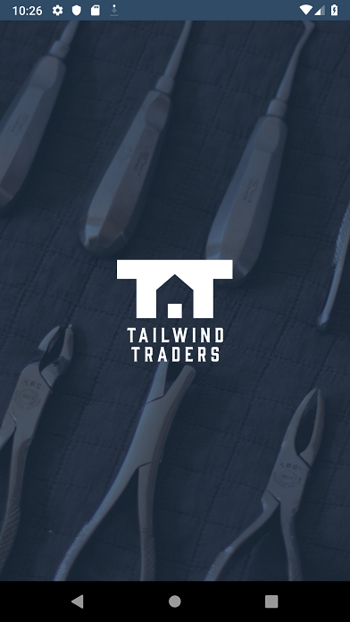
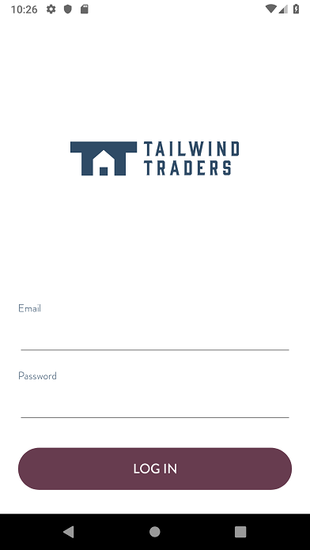
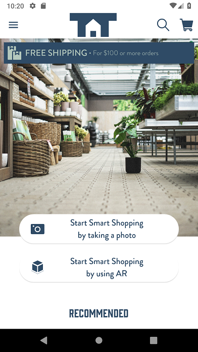
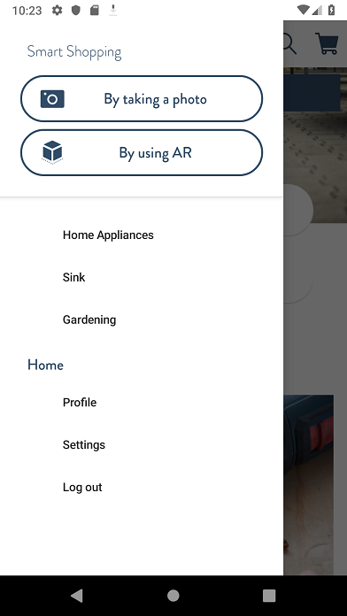
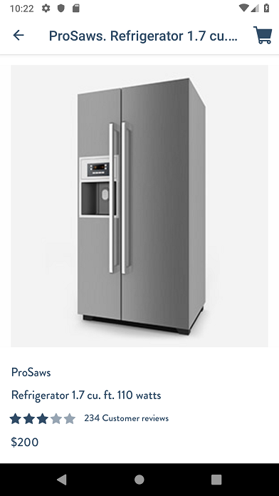
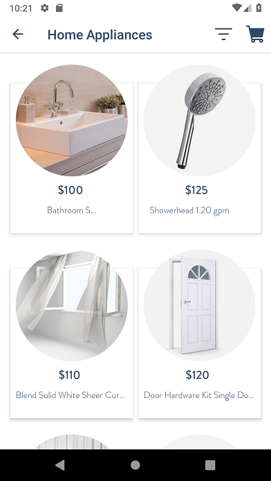
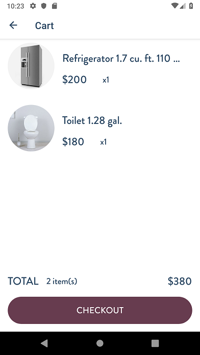

# Tailwind Traders Mobile Reference App

> Note: This app uses backend services detailed in the [Backend](https://github.com/Microsoft/TailwindTraders-Backend) repository.

You can also download the mobile apps connected to our public endpoints in your devices following these links:

* [Tailwind Traders iOS](https://aka.ms/tailwindtradersios)
* [Tailwind Traders Android](https://aka.ms/tailwindtradersandroid)

# Screens
Tailwind Traders App

# Xamarin.Forms 4

Latest features available in [Xamarin.Forms 4](https://docs.microsoft.com/en-us/xamarin/xamarin-forms/release-notes/4.0/4.0.0-sr4) have been added as [Shell](https://docs.microsoft.com/en-us/xamarin/xamarin-forms/app-fundamentals/shell/) navigation with routes and query parameters, and we added the new [CollectionView](https://docs.microsoft.com/en-us/xamarin/xamarin-forms/user-interface/collectionview/) control to show the different product list.

# TailwindTraders.UITests

There are some [Xamarin.UITests](https://docs.microsoft.com/en-us/appcenter/test-cloud/uitest/)  that are run in AppCenter to ensure the app works as expected. The UITests available have been designed with the best practices obtained from the experience of several developments in this way so we think it is a very good sample of how create UITests the good way.

# Repositories

For this demo we built several consumer and line-of-business applications with a common set of backend services. You can find all repositories below:

* [Tailwind Traders](https://github.com/Microsoft/TailwindTraders)
* [Backend (AKS)](https://github.com/Microsoft/TailwindTraders-Backend)
* [Website (ASP.NET & React)](https://github.com/Microsoft/TailwindTraders-Website)
* [Desktop (WinForms & WPF -.NET Core)](https://github.com/Microsoft/TailwindTraders-Desktop)
* [Rewards (ASP.NET Framework)](https://github.com/Microsoft/TailwindTraders-Rewards)
* [Mobile (Xamarin Forms 4.0)](https://github.com/Microsoft/TailwindTraders-Mobile)

# Contributing

This project welcomes contributions and suggestions.  Most contributions require you to agree to a
Contributor License Agreement (CLA) declaring that you have the right to, and actually do, grant us
the rights to use your contribution. For details, visit https://cla.microsoft.com.

When you submit a pull request, a CLA-bot will automatically determine whether you need to provide
a CLA and decorate the PR appropriately (e.g., label, comment). Simply follow the instructions
provided by the bot. You will only need to do this once across all repos using our CLA.

This project has adopted the [Microsoft Open Source Code of Conduct](https://opensource.microsoft.com/codeofconduct/).
For more information see the [Code of Conduct FAQ](https://opensource.microsoft.com/codeofconduct/faq/) or
contact [opencode@microsoft.com](mailto:opencode@microsoft.com) with any additional questions or comments.
